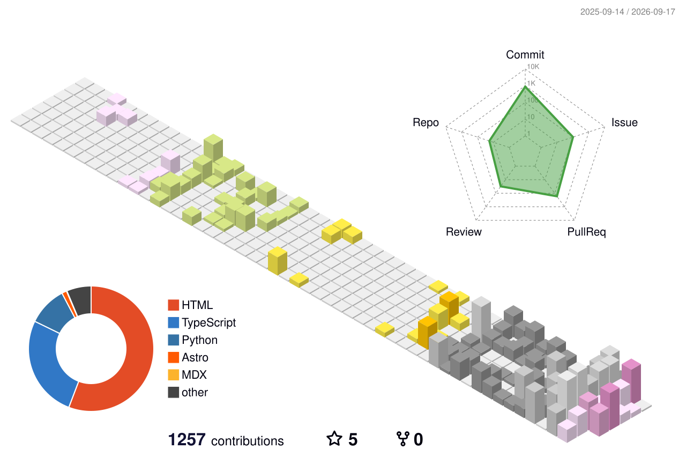

# Hi 👋 , I'm Joshua Klyne Pudadera
### Junior Full-Stack Developer · Backend & AI-Leaning · Data Entry and Research Specialist · Computer Science

Building full-stack apps and AI-assisted workflows — from restaurant POS systems to a published dengue-outbreak prediction model.

---

### About

- 🎓 BS Computer Science, Notre Dame of Marbel University (2021–2025)
- 🧪 Published first-author research: *Improving Prediction of Dengue Outbreaks Using Attention-based LSTM with Honey Badger Optimization* — IJLTEMAS Vol. 15 No. 6 (2026) 
- 🔭 Currently: Backend AI Intern @ FlyRank AI (Backend AI Engineering track)
- 🌱 Learning: agentic AI workflows and system design at scale
- 📫 Open to: Junior/Fresh-grad Full-Stack, Backend, Data Science or AI Engineering roles (remote)

---

### 🧰 Tech Stack & Ecosystem

**Languages**

**Frontend**

**Backend & APIs**

**Databases & Infra**

**Tools**

---

### 🚀 Highlights & Featured Projects

**[TVI-CAMS — Compliance & Batch Management System](https://github.com/shuakyle21/tesda-compliance-manager)** *(TypeScript · Next.js · Supabase · PostgreSQL)*
Internal system for tracking TESDA scholarship program batches (TWSP/CFSP) from onboarding through billing.
- Built a dependency-free TypeScript billing engine encoding official government financial rules — cost tranching, subsidy calculations, and audit-traceable outputs

**[Nenita Farm Lechon Haus — Restaurant POS](https://github.com/shuakyle21/nenitafarm-lechonhaus)** *(React 19 · Supabase · TypeScript · Tailwind)*
Cloud-based restaurant management system owned end-to-end: order taking, staff rostering, catering bookings, financial reporting.
- Role-based access via Supabase RLS, real-time sales dashboard, automated PDF reporting, offline-first order sync

**Dengue Outbreak Prediction — Published Research** *(Python · LSTM · Hyperparameter Optimization)*

First-author paper on an attention-based LSTM model for dengue forecasting, published in IJLTEMAS Vol. 15 No. 6 (2026).
- Designed an **attention-based LSTM** model and used **Honey Badger Optimization** (a metaheuristic search algorithm) to automatically tune its hyperparameters instead of tuning by hand
- Combined 10 years (2015–2024) of epidemiological, climate, and geographic data from the DOH Center for Health Development SOCCSKSARGEN, Google Earth Engine, and NAMRIA barangay shapefiles for Koronadal City, South Cotabato
- Result: cut prediction error (MSE) by **43.7%** vs. a standard LSTM, and **22.2%** vs. an attention-only LSTM without the optimization step

**[FastAPI Task CRUD API](https://github.com/shuakyle21/Week3_Assignment_TasksDB)** *(Python · FastAPI · PostgreSQL · Docker)*
Backend project from the FlyRank AI internship — a task management REST API.
- Evolved storage from an in-memory list → SQLite → containerized PostgreSQL, with docker-compose healthchecks and a gitignored `.env` setup

---

### 📊 GitHub & Activity Insights

